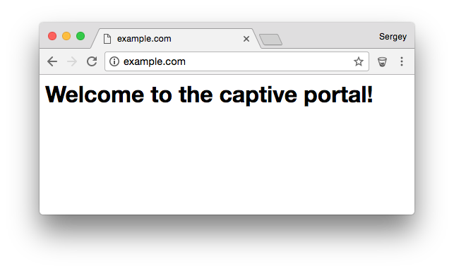

# Captive portal example

## Overview

This is a captive portal example. A captive portal is a DNS server that
points to itself to all DNS queries. This is used to route all Web requests
to a specified web page.

Build and flash this example. It'll start a WiFi access point Mongoose_XXXXXXX.
Join that access point (the password is `Mongoose`). Open your browser
and go to "http://example.com".
You'll end up on the simple web page that this app runs:

